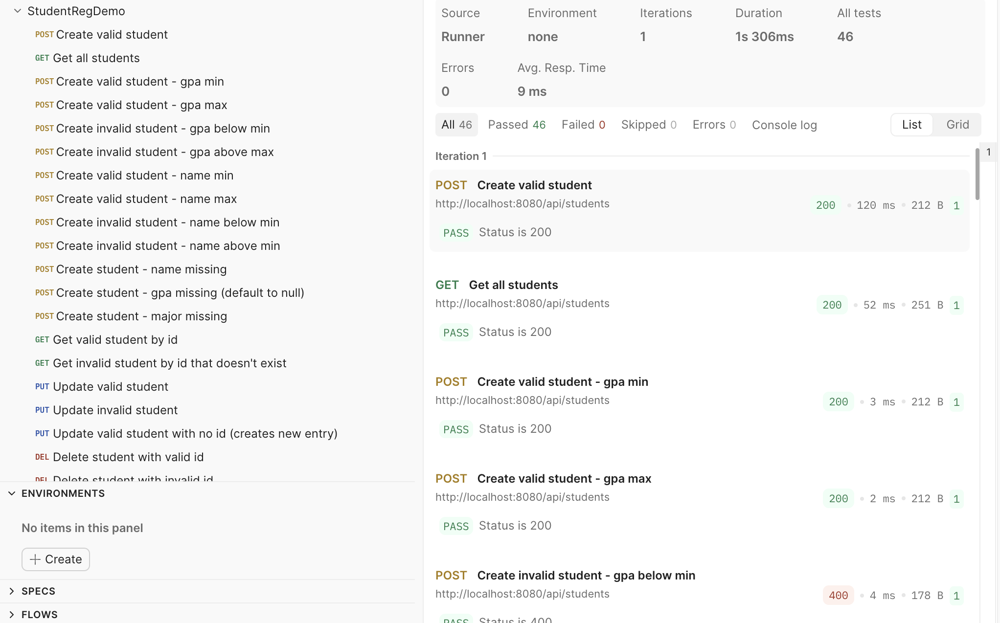

## Lab 5 - Postman
Program needs to be run in lab5/src/main/java/com/knowles/lab5/studentRegDemo/Application.java and Postman .json needs to be imported to run test cases. Test Case document in pdf format found in lab5 folder as well as .json with Postman requests. Some test cases were left out due to redundancy, such as testing the name constraints in both /api/students and /api/courses since they share the same validation (another example is not testing PUT for missing fields, since that was already tested with POST and they share the same validation).

